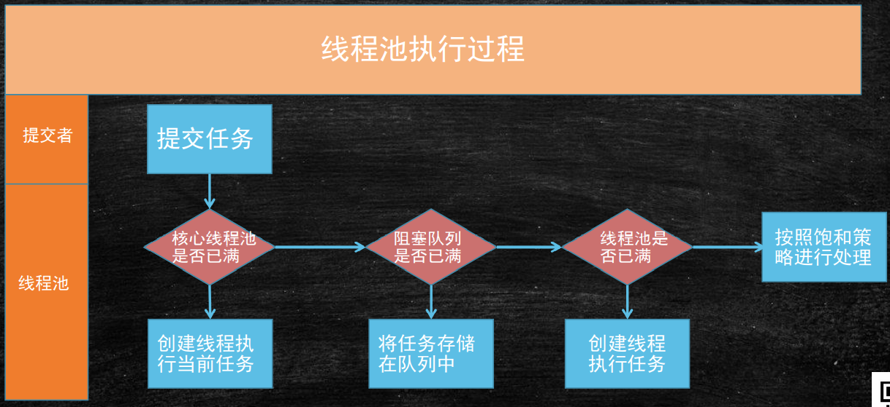

## 线程池工作原理

线程池执行所提交的任务过程：

	1、先判断线程池中核心线程池所有的线程是否都在执行任务。如果不是，则新创建一个线程执行刚提交的任务，否则，核心线程池中所有的线程都在执行任务，则进入第2步；

	2、判断当前阻塞队列是否已满，如果未满，则将提交的任务放置在阻塞队列中；否则，则进入第3步；

	3、判断线程池中所有的线程是否都在执行任务，如果没有，则创建一个新的线程来执行任务，否则，则交给饱和策略进行处理；
